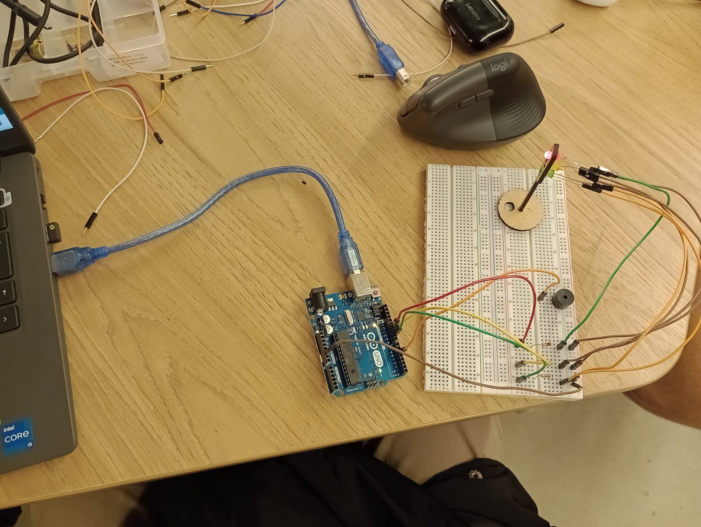

Para este projeto, criei um simulador de semáforo utilizando LEDs e um microcontrolador (Arduino ). Cada LED representa uma luz do semáforo (vermelho, amarelo e verde), e o código foi programado para alternar entre eles de maneira sequencial, respeitando tempos específicos para simular o comportamento de um semáforo real.

Componentes Utilizados

Microcontrolador (Arduino):

* Responsável pelo controle das portas e execução do código que define a sequência dos LEDs. O microcontrolador é essencial para programar a temporização exata de cada cor do semáforo, garantindo o funcionamento correto da simulação.

LEDs:

* LED Vermelho (porta 11): Representa a luz vermelha do semáforo, sinalizando parada.
* LED Amarelo (porta 10): Representa a luz amarela do semáforo, indicando atenção.
* LED Verde (porta 9): Representa a luz verde do semáforo, indicando que é seguro prosseguir.

Buzzer:

* (Porta 5) Este que emite um som no momento que a luz vermelha acende.

Resistores:

* Para limitar a corrente e proteger os LEDs de queima, resistores são conectados em série com cada LED. A resistência adequada depende das especificações dos LEDs e da tensão fornecida pelo microcontrolador.

Link: 

Imagem e vídeo que mostra isso:

Figura

Fonte: Material produzido pelos autores (2024)

 

# Template Avaliação Pares

### Avaliador: Nome do Avaliador

| Critério                                                                                                 | Contempla (Pontos) | Contempla Parcialmente (Pontos) | Não Contempla (Pontos) | Observações do Avaliador |
|---------------------------------------------------------------------------------------------------------|--------------------|----------------------------------|--------------------------|---------------------------|
| Montagem física com cores corretas, boa disposição dos fios e uso adequado de resistores                | Até 3              | Até 1,5                            | 0                        |        3                   |
| Temporização adequada conforme tempos medidos com auxílio de algum instrumento externo                  | Até 3              | Até 1,5                          | 0                        |      3                     |
| Código implementa corretamente as fases do semáforo e estrutura do código (variáveis representativas e comentários) | Até 3              | Até 1,5                          | 0                        |   3                        |
| Extra: Implmeentou um componente de liga/desliga no semáforo e/ou usou ponteiros no código | Até 1              |  Até 0,5                         |  0                        |    Fez um botão que toda vez que é acionado ele pula uma etapa e acende direto o verde, por exemplo, vai de vermelho pra verde ou de laranja pra verde ao invés do vermelho.                       |
|  |                                                             |  | |**Pontuação Total: 10**|

